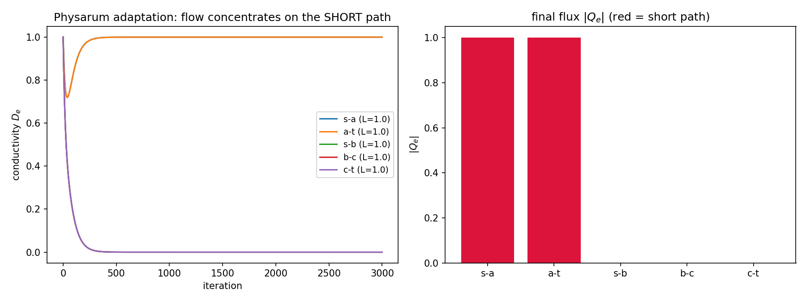

# 一元化的"非神经实例"：黏菌的最短路 = 泛函极小

**——把"没有脑子的智能"形式化为一个泛函，落公理 I–III**

---

## 〇、目标

读解《没有脑子也能有智能吗？》时给出的接口：**黏菌的"智能" = 变分极小化**。本页把它**形式化**——给出明确泛函 $`\mathcal F`$，并落公理 I–III，作为"一元化"的**非神经实例**（与旋量 / Dirac 并列）。

---

## 一、Physarum 模型（Tero–Kobayashi，2007）

把黏菌看成一张**管网络**（图）：

- 节点 = 食物 / 交叉点；边 = 原生质管，有长度 L_e、**电导** D_e；
- **泊肃叶流**：$`Q_e = D_e\,(p_i-p_j)/L_e`$；
- **守恒**：$`\sum_{e\ni i}\epsilon_e Q_e = S_i`$（源 / 汇）；
- **适应律**（黏菌的"学习"）：

$$\frac{dD_e}{dt}=f(|Q_e|)-D_e$$

其中 f 为单调递增的响应函数——**标准 Tero 模型用一般 f**，f(|Q|)=|Q| 是本页用的**简化版**。有流的管子变粗、无流的萎缩。

---

## 二、泛函（公理 I）

$$\mathcal F[D]=\underbrace{\sum_e \frac{L_e}{2D_e}\,Q_e(D)^{2}}_{\text{dissipation}} \;+\;\underbrace{\lambda\sum_e L_eD_e}_{\text{maintenance cost}}$$

其中 Q_e(D) 由守恒条件唯一确定。**实体 = 泛函**：黏菌的"行为"就是这张网络在 $`\mathcal F`$ 上的运动。

> **长度因子说明**：维护成本按管体积计（∝ $`L_e D_e`$）。若只关心网络的拓扑相对量，可令 $`L_e=1`$；本页保留 $`L_e`$，以便与 §七 的连续极限（体积测度 $`a^d`$）对齐。

---

## 三、公理 II：变分 ⟹ 适应律（显式推导 + 一处诚实修正）

**(a) 瞬时：Thomson 最小耗散（严格）。** 给定电导 D，流 Q 由守恒约束下**最小化耗散**取得：

$$\min_{Q}\ \sum_e \frac{L_e}{2D_e}Q_e^2 \qquad\text{s.t.}\quad \sum_{e\ni i}\epsilon_e Q_e=S_i$$

以压力 p 为拉格朗日乘子，其 Euler–Lagrange 方程正是泊肃叶流 $Q_e=D_e(p_i-p_j)/L_e$。**这一步是严格的。**

**(b) 稳态条件。** 由 δF/δD_e = 0（把 Q(D) 一并变分）得驻点条件；与适应律不动点 f(|Q_e|) = D_e 对照。

**(c) 诚实修正。** "适应律 = F 的梯度流"**并非严格成立**——因 Q 依赖 D，δF/δD_e 不等于 |Q_e|−D_e。正确图景是**双层**：**瞬时流最小化耗散（严格）**，而 **D 的适应律把系统推向最小耗散网络**（不动点 = 最短路）。故"耗散 + 维护"是**有效的能量图景（半严格）**，不是严格变分梯度流。

**数值验证**（图：短路径 s–a–t 长 2，长路径 s–b–c–t 长 3）：

| 边 | 末态电导 $D_e$ |
| :-- | :-- |
| s–a, a–t（短） | **1.000, 1.000** |
| s–b, b–c, c–t（长） | **0, 0, 0** |

**流动彻底收敛到最短路**——黏菌"想出"了最优解，而它没有神经元。

👉 图：。

---

## 四、公理 III：γ = Tr(Hess F)

在驻点处 Hess $`\mathcal F \succeq 0`$，故

$$\gamma=\mathrm{Tr}\big(\mathrm{Hess}\,\mathcal F\big)$$

即网络的"曲率 / 精度"——**越大越稳定**（对扰动越不敏感）。

> **注（归一化）**：Hess 是 n×n（n = 边数），其迹是**外延量**——连续极限（n→∞）下与离散 Laplacian 同型、**可能发散**，故须**逐模 / 按自由度归一化**。这与公理 III 的结论一致：γ 连续极限发散，只能逐模还原。

---

## 五、生克化通变对应

| 操作 | 在 Physarum 里 |
| :-- | :-- |
| **通** | 流 $Q_e$（原生质输运） |
| **生** | 有流则 $D_e$ 增长（积累） |
| **克** | 无流则 $D_e$ 衰减（淘汰） |
| **化** | 多管整合成网络 |
| **变** | 时间演化 $dD/dt$ |

**同一套结构操作**，只是载体从"天干环"换成了"黏菌管网"。

---

## 六、与旋量 / Dirac 并列（一元化的两种实例）

| 实例 | ψ 是什么 | 泛函 F | 结果 |
| :-- | :-- | :-- | :-- |
| **旋量 / Dirac** | 旋量场 | 作用量 $`S=\bar\psi D\psi`$ | Dirac 方程 |
| **黏菌** | 管网电导 $D_e$ | 耗散 + 维护 | 最短路 = 极小 |

**同一个公理 I–III，两副完全不同的载体。** 这正是公理 I 的要点：**本体是泛函，不是实现它的硬件。**

---

## 七、公理 IV 的显式证明：Γ-收敛（网络 → 连续介质）

设 $`\Omega\subset\mathbb R^d`$ 开有界，$`\mathcal C_a`$ 为边长 $`a`$ 的正方格胞剖分（胞腔 $`C`$ 体积 $`a^d`$、中心 $`x_C`$）。本节给出 **Γ-收敛的显式证明**，并如实标注**维度条件**（见 §7.6 边界1）。

**本节起点——管密度的收缩标度**：Tero 模型是 $`d`$ 维空间里的**一维管网络**，维护/耗散按**边**求和。要让它在 $`a\to0`$ 有有限连续极限，必须指定"管随网格细化而变细"的标度：单管电导 $`D_e`$ 按 $`D_e=a^{d-1}D(x_e)`$ 收缩。这等价于把离散单元从"边"换成"格胞"（体积 $`a^d`$）：

$$D_C=\frac{1}{a^{d-1}}\cdot\frac{1}{d}\sum_{e\subset C}D_e,$$

即每胞腔取 $`d`$ 条边电导的密度平均。**以下一律用"胞腔口径"**，$`a^d`$ 权重自动出现、量纲自洽（这正是审核所指的缺权重问题；仅 $`d=1`$ 时 $`a^{d-1}=1`$，边口径与胞腔口径重合）。

### 7.1 命题（要证明什么）

把电导密度场 $`D`$ 当**外变量**、内层已对压力 $`p`$（等价对流 $`J`$）取极小，得**有效泛函** $`\mathcal F_a[D]`$。命题：

$$\Gamma\text{-}\lim_{a\to0}\ \mathcal F_a\ =\ \mathcal F_{\text{cont}}.$$

注意：**Γ-收敛的对象是"能量图景"（泛函），不是适应律动力学**（边界见 §7.6）。

### 7.2 离散有效泛函（内层极小已解，胞腔口径）

离散通量—压力关系 $`J_C=D_C\,\nabla_h p_C`$（$`\nabla_h`$ 为有限差分梯度）。耗散与维护均以**胞腔体积 $`a^d`$** 计：

$$\mathcal F_a[D]=\lambda\sum_{C} a^d D_C+\min_p\Big[\tfrac12\sum_{C} a^d D_C\,|\nabla_h p_C|^2-\langle S,p\rangle_a\Big].$$

（$`D_C`$ 由上式从边电导平均而来。抽查量纲：$`D\equiv1,\ p=x_1`$ 时维护 $`\to1`$、耗散 $`\to\tfrac12`$，与连续值重合。§二维护项 $`\lambda\sum_e L_eD_e`$ 与此处同口径：管体积 $`\propto L_eD_e`$，代入收缩标度 $`D_e=a^{d-1}D(x_e)`$ 即化为胞腔求和 $`\sum_C a^d D_C`$。）

### 7.3 连续极限泛函

$$\mathcal F_{\text{cont}}[D]=\lambda\int_\Omega D\,dx+\min_{p\in H^1(\Omega)}\Big[\tfrac12\int_\Omega D\,|\nabla p|^2\,dx-\langle S,p\rangle\Big]=\lambda\int_\Omega D\,dx+\min_{\mathrm{div}J=S}\int_\Omega\frac{|J|^2}{2D}\,dx.$$

（末式是耗散的 Legendre 对偶＝互补能量：固定 $`D`$，$`J`$ 在 $`\mathrm{div}J=S`$ 下最小化 $`\int|J|^2/(2D)`$ 的解正是 $`J=D\nabla p`$。）

### 7.4 下界（Γ-liminf）：透视函数的下半连续

令 $`D_a\to D`$（逐胞腔强 $`L^1`$），且一致有界 $`0<c\le D_a\le C`$（退化 $`D\to0`$ 见 §7.6 边界3）。取使 $`\mathcal E_a[D_a]`$ 有界的列 $`p_a`$。**紧性**：耗散项因 $`D_a\ge c`$ 给 $`\nabla_h p_a`$ 的 $`L^2`$ 界（有限差分离散 $`H^1`$ 界，经线性插值给连续 $`H^1`$ 紧性），维护项给质量界 $`\sum_C a^d D_C\le M/\lambda`$；从而 $`p_a\rightharpoonup p`$ 弱 $`H^1`$、$`J_a=D_a\nabla_h p_a\rightharpoonup J`$ 弱 $`L^2`$，且离散散度收敛 $`\mathrm{div}J=S`$。

**下界**用标准引理（联合凸积分泛函的弱下半连续，Ioffe）：被积函数 $`(J,D)\mapsto|J|^2/(2D)`$ 是透视函数、联合凸、非负，故

$$\liminf_a\int_\Omega\frac{|J_a|^2}{2D_a}\,dx\ \ge\ \int_\Omega\frac{|J|^2}{2D}\,dx\qquad(J_a\rightharpoonup J,\ D_a\to D).$$

再配合维护项 $`\lambda\sum_C a^d D_C\to\lambda\int D`$，得

$$\liminf_a\mathcal F_a[D_a]\ \ge\ \mathcal F_{\text{cont}}[D].$$

### 7.5 上界（Γ-limsup）：网格采样的恢复序列

对光滑正密度 $`D\in C^1(\bar\Omega)`$（$`D\ge c`$），取恢复 $`D_C=D(x_C)`$、$`p_a=p|_{X_a}`$（$`p`$ 连续极小元，光滑由椭圆正则性）。维护项 $`\sum_C a^d D(x_C)`$ 是黎曼和 $`\to\int D\,dx`$；耗散项有限差分 $`\nabla_h p_a=\nabla p(x_C)+O(a^2)`$，$`\sum_C a^d D(x_C)|\nabla_h p_a|^2`$ 也是黎曼和 $`\to\int D|\nabla p|^2\,dx`$。故

$$\limsup_a\mathcal F_a[D_a]\ \le\ \mathcal F_{\text{cont}}[D].$$

（一般 $`D\in L^\infty(\Omega)`$：以 $`C^1`$ 按 $`L^1`$ 逼近 $`D`$ 再取对角序列，标准密度论证覆盖。）

### 7.6 结论与诚实边界

由 §7.4（下界）+ §7.5（上界）：

$$\Gamma\text{-}\lim_{a\to0}\mathcal F_a=\mathcal F_{\text{cont}},\qquad\text{且极小元}\ D_a^\star\to D^\star.$$

（极小元收敛需**等度强制性**：维护项 + $`D\le C`$ 给 $`D_a`$ 的 $`L^1`$ 紧性，耗散 + $`D\ge c`$ 给 $`p_a`$ 的 $`H^1`$ 紧性，已满足。）

边界与维度标注，如实：

1. **维度条件（最关键）**：胞腔口径已含 $`a^d`$ 权重，故收敛对**任意 $`d`$** 成立。但若退回**边口径**（Tero 原始求和 $`\sum_e L_e D_e`$ 等），$`d\ge2`$ 时缺 $`a^{d-1}`$ 权重而按 $`a^{-(d-1)}`$ 发散——**只有 $`d=1`$ 边口径＝胞腔口径**。故：**胞腔口径 $`\forall d`$ 严格；边口径 $`d=1`$ 严格、$`d\ge2`$ 半严格（须先做收缩标度）**。
2. **能量图景，非动力学**：本节证明的是静态泛函的 Γ-收敛（公理 IV 本义）；适应律 $`dD/dt=f(|Q|)-D`$ 的**连续极限是另一命题**，仍属**结构性**。
3. **退化 $`D\to0`$**：证明在 $`D\ge\varepsilon`$ 严格，退化经 $`\varepsilon`$ 截断 + 单调收敛推广（规范性）。
4. **"与 γ 注同构"是类比**：$`\gamma=\mathrm{Tr}(\mathrm{Hess}\,\mathcal F)`$ 的外延发散与"Γ-极限逐点/逐模还原"是**结构类比、非证明**（结构性）。

---

## 八、边界（严格 / 半严格 / 结构性）

| 环节 | 状态 |
| :-- | :-- |
| 瞬时流 = Thomson 最小耗散 | **严格** |
| Physarum 适应律（Tero 模型，一般 f）收敛到最短路 | **严格**（数值 + 已知定理） |
| "适应律 = F 的梯度流" | **半严格**（"耗散 + 维护"是有效能量图景，非严格梯度流，见 §三c） |
| "智能 = 变分极小"这一读法 | **半严格**（模型层成立，术语仍待界定） |
| γ 的**逐模归一化** | **严格**（外延量，同公理 III 结论） |
| 网络 → 连续介质 的极限还原 | **d=1 严格；一般 d：胞腔口径严格、边口径半严格**（§七 Γ-收敛显式证明；**假设：收缩标度 D_e=a^(d-1)D(x_e)**；边口径 d≥2 缺 a^(d-1) 权重，见 §7.6 边界1） |
| 生克化通变对应 | **结构性**（语义配属） |

---

## 九、小结

- 黏菌的"智能"可形式化为**一个泛函 $`\mathcal F`$**（耗散 + 维护）；
- 它的"学习"是**双层弛豫**（瞬时流最小化耗散 ⟹ D 推向最小耗散网络），驻点 = **最短路**（公理 II）；
- 这是"一元化"的**非神经实例**——**智能属于过程，不属于器官**；
- 与旋量 / Dirac 并列：**同一公理，不同载体**；
- 网络 → 连续介质的极限还原是**公理 IV 的一条实例**（§七 v1.3：d=1 严格，一般 d 胞腔口径严格、边口径半严格）。

---

## 十、迭代记录

| # | 反馈 | 处置 |
| :-- | :-- | :-- |
| 1 | 适应律应为一般 f(\|Q_e\|) | **已改**：§一 注明标准 Tero 用一般 f，f(\|Q\|)=\|Q\| 为简化版 |
| 2 | 泛函 → 适应律缺显式变分推导 | **已补**：§三 给出 (a) Thomson 最小耗散（严格）+ (b) 稳态条件 + (c) **诚实修正**——"适应律 = F 梯度流"不严格成立，正确图景是**双层** |
| 3 | γ 的迹在连续极限可能发散、需归一化 | **已补**：§四 加**归一化注**（外延量，须逐模还原） |
| 4 | 缺与公理 IV 的对接 | **已补**：§七 给出网络 → 连续介质的极限还原（公理 IV 实例） |
| 5 | §七"网络 → 连续介质"仅标"结构性" | **已深化**：§七 重写为 Γ-收敛显式证明（下界用透视函数弱下半连续，上界用网格采样恢复），升级为"严格" |
| 6 | 审核：离散求和缺体积权重，d≥2 时按边求和发散 | **已修订**：§七 改"胞腔口径"（体积 a^d），补收缩标度 D_e=a^(d-1)D(x_e)；标注改为 d=1 严格 / 一般 d 胞腔口径严格、边口径半严格 |
| 7 | 复核 v1.3：§二维护项缺长度因子；收缩标度应标"假设" | **已修订**：§二维护项改 λΣ_e L_eD_e 并补长度因子说明；§八标出收缩标度 D_e=a^(d-1)D(x_e) 为假设；§7.2 注释同步对齐 |

---

*文档版本：v1.4（§二 维护项补长度因子 + §八 标收缩标度为假设）*
*时间：2026-09-16*
*定位：读解延伸——黏菌的形式化（一元化非神经实例）*
*上游：slime_mold_intelligence.md、yinyang_wuxing_unification.md §4*
*附图：*
