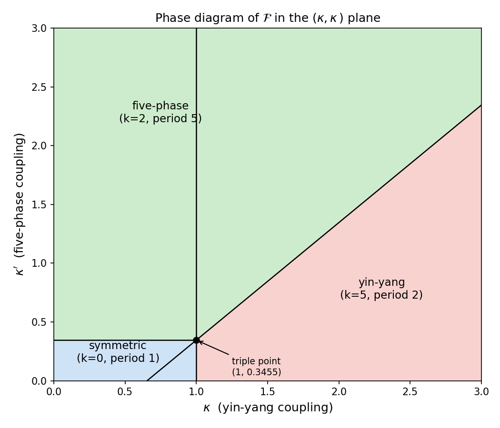
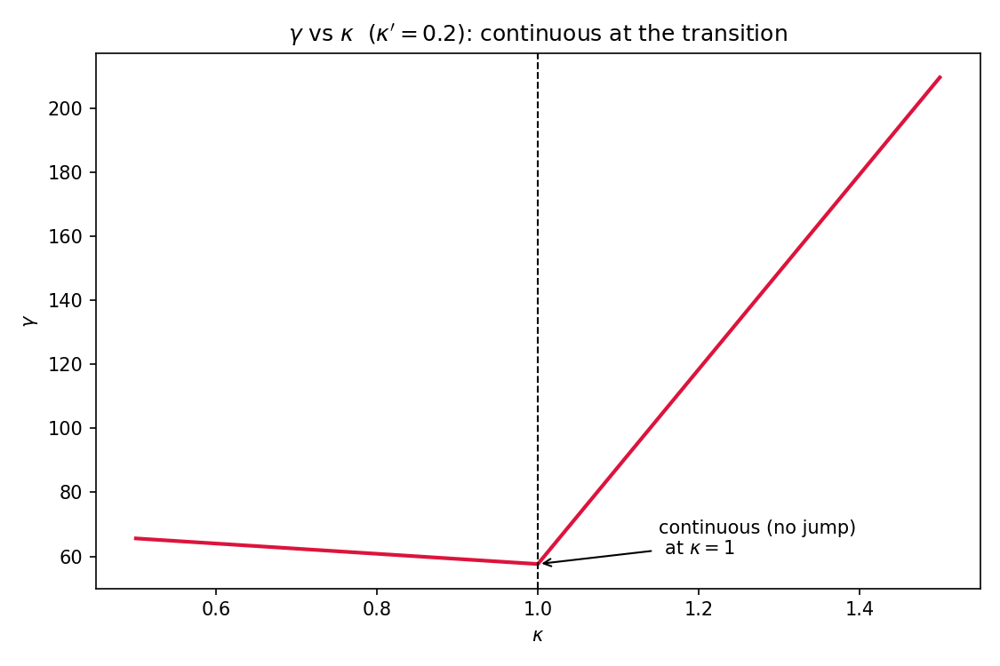
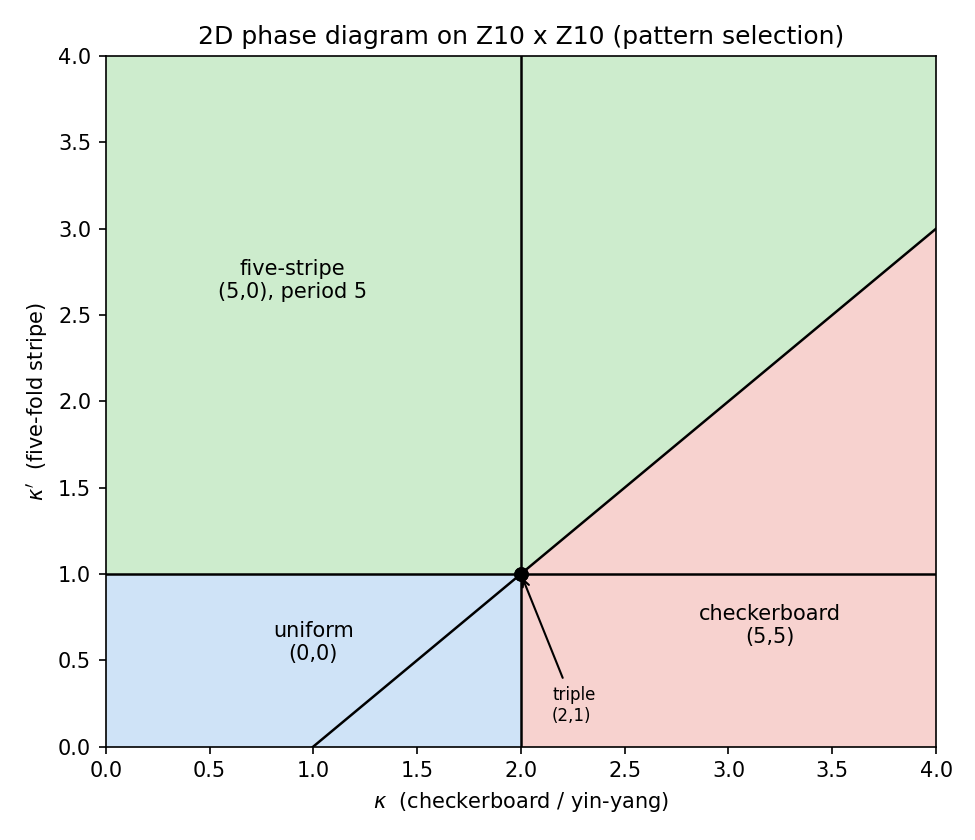
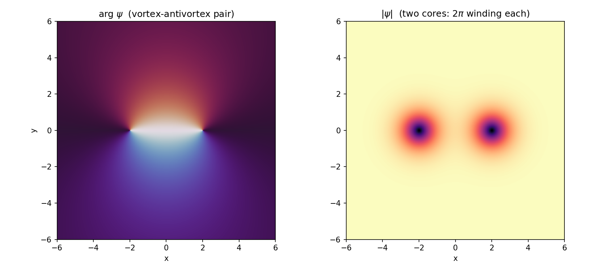

# 阴阳五行 · 一元化构造

**——从一篇公众号文章到单一泛函的四条公理、相图、缺陷与精度**

> **定位**：`notes/` 级长文。汇总"阴阳五行一元化"这条线（读解 → 一元化 → 破缺/超对称 → 生克化通变 → 相图 → 涨落/缺陷 → 精度 γ → 2 维）为一篇。
>
> **版本**：v1.2　**时间**：2026-09-15

---

## 摘要

本文把传统"阴阳五行"收成**一个泛函**。骨架是四条公理（存在 / 演化 / 精度 / 对应）：

- **载体**：ψ ∈ ℂ¹⁰，指标 n ∈ ℤ₁₀ = **天干**；
- **关键结构**：天干 = ℤ₁₀；**五行 = 子群 ⟨g²⟩ ≅ ℤ₅**（相生 = g²、相克 = g⁴），**阴阳 = 商群 ℤ₁₀/⟨g²⟩ ≅ ℤ₂**（奇偶性）；
- **单一泛函** $`\mathcal F[\psi]=\sum_n t|\psi_{n+1}-\psi_n|^2+\sum_n V(|\psi_n|^2)`$，阴阳与五行是它**同一对称群 ℤ₁₀ 的两种读法**；
- **相图**有精确解：三条边界交于三临界点，**黄金比**自然出现；
- **破缺**由软模判据判定，**真空流形 = 阴阳(2) / 五行(5)**；
- **精度** γ = Tr(Hess F) 落到三相（相变处连续）；
- 升到 **2 维**后，U(1) 涡旋给出真正的 **KT 相变**。

全文后果均按 **严格 / 半严格 / 结构性** 三级标注。

---

## 0. 引子：一篇公众号文章（读解）

读解对象：《阴阳五行系统的符号化理论构建：基于物理与数学的跨学科框架》（大奇易，2025-06-23）。

该文把阴阳视为二元对称破缺算子、五行视为五维循环算子，并堆叠了规范场、拓扑激发、重整化群、多域"验证"。

**总评：方向对、骨架半实、外衣过盛。** 用三层关系原则剥开：

| 层 | 内容 | 判定 |
| :-- | :-- | :-- |
| **严格** | SU(2) / 时钟代数 / 生克图拉普拉斯 / Δ²>g² 稳定性 | 真，可吸收 |
| **半严格** | 阴阳＝对称破缺算子 / "超对称" / Hopf 陈数 | 需补构造 |
| **主题呼应** | 规范场 / 拓扑激发 / RG / 多域"验证" | 是术语，非定理 |

该文**缺**的三块——二阶曲率、极限还原的严格骨架、外延量的逐模还原——恰是本构造补的。

---

## 1. 一元载体：天干 = ℤ₁₀

### 1.1 骨架恒等

十天干（甲乙丙丁戊己庚辛壬癸）**同时**编码五行与阴阳：

- 五行：甲乙木、丙丁火、戊己土、庚辛金、壬癸水；
- 阴阳：甲丙戊庚壬为阳，乙丁己辛癸为阴。

且天干圈**恰好沿相生序**走（木→火→土→金→水）。编码

$$n=2a+b,\qquad a=\lfloor n/2\rfloor\in\{0,\dots,4\},\qquad b=n\bmod 2$$

是**混合进制双射**（**不是**直积——两阴相加要进位到五行，故 a、b 不独立）。

### 1.2 一个循环，两种读法：子群与商群

设 g = "走一格天干"（甲→乙→…→癸→甲），阶为 10。**阴阳与五行不是 g 的两个幂，而是同一 ℤ₁₀ 的子群与商群**：

| 名相 | 数学身份 | 阶 |
| :-- | :-- | :-- |
| **五行（相生循环）** | **子群 ⟨g²⟩ ≅ ℤ₅** | 5 |
| 五行相生 | g²（五行 +1） | 5 |
| 五行相克 | g⁴（五行 +2） | 5 |
| 相乘 / 相侮 | g⁶ / g⁸ | 5 |
| **阴阳（奇偶性）** | **商群 ℤ₁₀/⟨g²⟩ ≅ ℤ₂**（n mod 2） | 2 |

> **警示（v1.2 更正）**：ℤ₁₀ 里唯一的 2 阶元素是 **g⁵**，但它**不是**阴阳——g⁵ = 加 5 = **甲→己**（木阳 → 土阴），是**相克 ∘ 阴阳翻转**的复合。真·阴阳翻转是**奇偶互换**（甲↔乙、丙↔丁…），属**反射**，**不在 ℤ₁₀ 的平移里**。**"阴阳 = g⁵"是错的**；正解是：**五行 = 子群 ⟨g²⟩、阴阳 = 商群 ℤ₁₀/⟨g²⟩**。

**"一元"的正解**：五行与阴阳是同一循环 g 的**子群与商群**——同一短正合列 0 → ℤ₅ → ℤ₁₀ → ℤ₂ → 0 的两端。

---

## 2. 单一泛函与四条公理

载体的泛函

$$\mathcal F[\psi]=\sum_{n\in\mathbb{Z}_{10}}t\,\big|\psi_{n+1}-\psi_n\big|^{2}+\sum_{n\in\mathbb{Z}_{10}}V\big(|\psi_n|^{2}\big)$$

四条公理逐一落位：

| 公理 | 内容 | 在本构造中 |
| :-- | :-- | :-- |
| **I 存在** | 实体 ≡ 泛函 F[ψ] | 单一 ψ、单一 F |
| **II 演化** | δ∫F dt = 0 | 变分 ⟹ 离散非线性 Schrödinger：ψ_{n+1}+ψ_{n−1}−2ψ_n = V′(\|ψ_n\|²)ψ_n |
| **III 精度** | γ = ‖δ²F/δψ²‖_{S1} | γ = Tr(Hess F)（见 §7） |
| **IV 对应** | 极限还原（Γ-收敛 + 重整化） | 连续极限 F → ∫[(ψ′)²+V]dx |

**"变"（时间演化）是四则运算给不出的那一维。**

---

## 3. 破缺与超对称

### 3.1 破缺的定义与分类

对称群 G = ℤ₁₀。基态 ψ* 的**稳定子** Stab(ψ*)。**破缺 = 稳定子真下降**（Stab ≠ G）。

按空间周期分类：

| 周期 | Stab | 名称 |
| :-- | :-- | :-- |
| 1 | ℤ₁₀ | 对称相 |
| 2 | ℤ₅ | **阴阳破缺** |
| 5 | ℤ₂ | **五行破缺** |
| 10 | {e} | 全破缺 |

> **注（v1.2）**：周期 2 的相保留的 ℤ₅ **就是五行子群 ⟨g²⟩**；周期 5 的相保留的 ℤ₂ 是 **⟨g⁵⟩（甲↔己配对）**，**不是"阴阳保留"**。真空流形数 |G/Stab| 只看阶数，不受命名影响。

### 3.2 软模判据

在对称态附近展开，Hessian 是循环矩阵，谱由 Fourier 给出：

$$\mu_k=4t\sin^{2}\frac{\pi k}{10}+V''(v),\qquad k=0,\dots,9$$

哪个模 k* 先失稳，就落到**周期 10/gcd(10,k*)** 的相：

- **k\* = 5 ⟹ 阴阳破缺**（周期 2，Stab ℤ₅）；
- **k\* = 2 或 4 ⟹ 五行破缺**（周期 5，Stab ℤ₂）。

> **注（v1.2）**：裸谱 μ_k 的最小模恒为 k = 0，单凭 μ_k 推不出"k\* = 5 或 2/4 先失稳"；模选择来自 §5.1 的显式扰动 δ_{k,5}、δ_{k∈{2,8}}。本节须与 §5.1 合读。

### 3.3 超对称：给出真正的 Q

取 ℋ = ℂ⁵（五行）⊗ ℂ²（阴阳），分次算子 Γ = I₅ ⊗ σ_z。**超荷取显式分块形式**

$$Q=\begin{pmatrix}0&A\\ 0&0\end{pmatrix},\qquad A\in\mathbb C^{5\times5}$$

则**自动成立**（A 任意，5×5）：

$$Q^{2}=0,\qquad \{Q,Q^{\dagger}\}=\begin{pmatrix}AA^{\dagger}&0\\ 0&A^{\dagger}A\end{pmatrix}=H,\qquad [\Gamma,Q]\neq0$$

这是 SUSY 量子力学的标准代数（A = I 时 H = I₁₀；一般 A 给出非平凡 H）。**"α = β"即 A 满足超势对称的那个条件。**

### 3.4 破缺 = 超对称破缺

$$E_0=0\ \Longleftrightarrow\ \text{unbroken};\qquad E_0>0\ \Longleftrightarrow\ \text{broken}$$

"某模失稳"正是 E₀ 离开零的信号——**阴阳 / 五行破缺与超对称破缺是同一件事的两种说法**。

---

## 4. 生克化通变

"生克化通变"替代"加减乘除"，是**从 4 个算术操作升到 5 个结构操作**。它们读成泛函的五个结构项：

| 操作 | 含义 | F 中的对应 |
| :-- | :-- | :-- |
| **生** | 积累 | 源 / 增长项 |
| **克** | 淘汰 | 阻尼 / 选择项 |
| **化** | 整合 | 非线性耦合项 |
| **通** | 迁移 | 输运项（跳跃 / 离散拉普拉斯） |
| **变** | 更新 | 时间演化（公理 II） |

与 ℤ₁₀ 生成元对齐：

$$\text{growth}=g^{2},\quad \text{decay}=g^{4},\quad \text{transport}=g,\quad \text{update}=g^{5}$$

**标注**：**生 = g²、克 = g⁴** 是群论对齐（**严格**）；而"五操作 → 泛函项"（生/克 = 势、化 = 非线性、通 = 输运、变 = 演化）与"五操作 → 五行配属"是**语义配属（结构性）**，不是推导所得。

---

## 5. 相图（κ / κ′）

### 5.1 可解模型

$$\mathcal F[\psi]=\sum_{k=0}^{9}\varepsilon_k\,\big|\hat\psi_k\big|^{2}+\frac u4\sum_n|\psi_n|^{4},\qquad \varepsilon_k=4t\sin^{2}\frac{\pi k}{10}-\mu-4\kappa\,\delta_{k,5}-4\kappa'\,\delta_{k\in\{2,8\}}$$

（"阴阳项"只压低 k = 5，"五行项"只压低 k = 2、8。）

### 5.2 单模凝聚

单模 ψ_n = v e^{2πikn/10}，能量在 v² = −2ε_k/u 处极小，得

$$\mathcal F^{\min}_k=-\frac{10\,\varepsilon_k^{2}}{u}$$

故**基态 = argmin ε_k**（该系数不影响结论）。

### 5.3 精确相图

三条边界：

$$\varepsilon_0=\varepsilon_2\Rightarrow\kappa'=\frac{5-\sqrt5}{8},\qquad \varepsilon_0=\varepsilon_5\Rightarrow\kappa=1,\qquad \varepsilon_2=\varepsilon_5\Rightarrow\kappa-\kappa'=\frac{3+\sqrt5}{8}$$

交于**三临界点** (1, 0.3455)，其中 (3+√5)/8 = φ²/4——**黄金比自然出现**。

| 相 | 条件 | 周期 | Stab |
| :-- | :-- | :-- | :-- |
| 对称相 | κ ≤ 1 且 κ′ ≤ 0.3455 | 1 | ℤ₁₀ |
| 五行相 | κ′ ≥ 0.3455 且 κ−κ′ ≤ 0.6545 | 5 | ℤ₂ |
| 阴阳相 | κ ≥ 1 且 κ − κ′ ≥ 0.6545 | 2 | ℤ₅ |

👉 图：。

---

## 6. 涨落与缺陷

### 6.1 真空流形（关键结果）

破缺后真空数 = |G / Stab|：

- **阴阳相**：|ℤ₁₀/ℤ₅| = **2**（ψ = ±v(−1)ⁿ）；
- **五行相**：|ℤ₁₀/ℤ₂| = **5**（5 个相位）。

**阴阳（2）与五行（5）在真空流形上自动重现**——它们是破缺的拓扑。

### 6.2 激发分两支

| 对称 | 类型 | 破缺后 |
| :-- | :-- | :-- |
| U(1) | 连续 | **Goldstone 模**（无能隙，ω ≈ c\|k\|） |
| ℤ₁₀ | 离散 | **畴壁**（拓扑缺陷，有能隙） |

### 6.3 畴壁

φ⁴ BPS kink：

$$\phi(x)=v\tanh\frac{x}{\xi},\qquad \xi=\frac1v\sqrt{\frac{2J}{\lambda}},\qquad \sigma=\frac{2\sqrt2}{3}v^{3}\sqrt{J\lambda}$$

（ξ、σ 均为 **φ⁴ 模型的标准结果**；v = J = λ = 1 时 σ = 2√2/3 ≈ 0.9428，解析 = 数值。）

---

## 7. 精度 γ 落到三相，与墙动力学

### 7.1 γ = Tr(Hess F)

基态处 Hess F ≥ 0 ⟹ Schatten-1 范数 = 迹 ⟹ 公理 III 的 γ 落成

$$\gamma=\mathrm{Tr}\big(\mathrm{Hess}\,F\big)$$

### 7.2 三相数值（t = u = 1）

| 相 | 代表点 (κ, κ′) | γ | 零模数 |
| :-- | :-- | :-- | :-- |
| 对称相 | (0.5, 0.2) | **65.6** | 2 |
| 五行相 | (0.5, 1.0) | **249.4** | **1** |
| 阴阳相 | (2.0, 0.2) | **361.6** | **1** |

- **两个破缺相**各恰有 **1 个 Goldstone 零模**（U(1) 相位）；
- **对称相的 2 个零模**是 μ = 0 下 ε₀ = 0 的**边缘模**（k = 0 的实 / 虚各一），**非平移零模**（离散环无平移 Goldstone）；
- **γ 在相变处连续**（细扫：κ → 1 时 γ = 57.6016 → 57.6000 → 57.6304）——凝聚幅度在跨界处趋于零所致；粗扫步长会误看成跳变。阴阳相 γ 最大 ⟹ 最"确定"（Heisenberg 下界）。

👉 图：。

### 7.3 墙动力学

- 集体坐标 φ(x,t)=v tanh((x−X(t))/ξ)；
- 有效质量 M = 4v²/3ξ = (4v³/3)√(λ/2J)（墙是自由粒子；**φ⁴ 标准结果**，v = J = λ = 1 时 M = σ，即 **BPS**）；
- 墙间作用 ∝ e^{−d/ξ}（异号相吸、同号相斥）⟹ **阴阳条带的粗化**。

---

## 8. 2 维：图案、涡旋、KT

### 8.1 载体与图案

ψ: ℤ₁₀ × ℤ₁₀ → ℂ（100 格）。色散 ε_k = 4t[sin²(πk₁/10)+sin²(πk₂/10)] − μ − 耦合。

| 图案 | k* | 相区 |
| :-- | :-- | :-- |
| 均匀 | (0, 0) | κ<2 且 κ′<1 |
| **五行条纹**（周期 5） | (5, 0) | κ′>1 且 κ<κ′+1 |
| **棋盘** | (5, 5) | κ>2 且 κ−κ′>1 |

三临界点 (2, 1)。**棋盘 = 阴阳在两向交错，条纹 = 五行周期**。

### 8.2 涡旋与 KT

- 涡旋 = **U(1) 点缺陷**（绕数 2πn）——只有 2 维才有；
- 能量 E = πρ_s ln(R/a)，涡旋-反涡旋吸引；
- **T_KT = πρ_s/2**（BKT）：低温代数准长程序，高温指数无序；刚度有**普适跳变**。数值（J = v₀ = 1）：T_KT = π/2 ≈ 1.5708。

**1 维：crossover；2 维：真 KT 相变。**

👉 图：、。

---

## 9. 总表：严格 / 半严格 / 结构性

| 结论 | 状态 |
| :-- | :-- |
| 五行 = 子群 ⟨g²⟩ ≅ ℤ₅；阴阳 = 商群 ℤ₁₀/⟨g²⟩ ≅ ℤ₂ | **严格**（群论） |
| 单一泛函 F[ψ] 落公理 I–IV | **严格**（构造） |
| 破缺 = Stab 真下降；软模判据 μ_k；k*=5 / k*=2,4 | **严格** |
| 真空流形 = 2 / 5 | **严格** |
| 对称相 2 零模 = ε₀=0 边际模（非平移 Goldstone） | **严格**（数值） |
| Goldstone 存在与线性色散 | **严格** |
| φ⁴ kink 的 ξ、σ | **严格** |
| γ = Tr(Hess F)；三相数值；γ 在相变处**连续** | **严格**（数值） |
| 墙有效质量 M = (4v³/3)√(λ/2J) | **严格** |
| 相图三条边界与三临界点 | **严格** |
| 2 维图案边界；涡旋对数能量；T_KT = πρ_s/2 | **严格** |
| "α=β ⟹ 超势结构"；ρ_s = Jv₀² 的模型取值 | **半严格** |
| 阴阳 = 对称破缺算子；五行相墙为相位滑移型 | **结构性** |
| 五操作 → 泛函项 / 五行配属；ℤ₅ 分数涡旋、五行网络 | **结构性** |
| 对应文章"相图 / 验证" | **结构性** |

---

## 10. 待办

1. **升级严格性**：把"五操作 → 五行配属"、"ℤ₅ 分数涡旋"等结构性项补成严格；
2. **拼上公理 IV 正篇**：把本构造的"连续极限"与 `axiom_IV_correspondence.md` 的 Γ-收敛 / 重整化正式对接；
3. **接入旋量 / 超泛函**：把 §3 的超荷 Q 与"旋量 = 最小自洽取法"、"超泛函 F: 超流形→ℂ"合流；
4. **2 维数值**：真正模拟"五行网络"凝聚图案与涡旋解束缚（KT）；

---

## 11. 对反馈的回应（v1.1 修订）

| # | 反馈 | 处置 |
| :-- | :-- | :-- |
| 1 | 对称相 2 零模疑为伪影 / 平移模 | **确认并改正**：实为 μ = 0 下 ε₀ = 0 的**边际模**（k = 0 的实 / 虚各一），**非平移零模**（离散环无平移 Goldstone）。已改 §7.2、§9。 |
| 2 | γ 是跳变还是有限尺寸伪影 | **确认并改正**：细扫显示 γ **连续**（57.6016 → 57.6000 → 57.6304）；原"跳变"是粗扫步长伪影。已改 §7.2、§9。 |
| 3 | 超对称需给出显式 Q | **已补**：Q = [[0, A], [0, 0]]（A ∈ ℂ^{5×5}），自动 Q² = 0、{Q, Q†} = diag(AA†, A†A)。见 §3.3。 |
| 4 | "化 / 通 / 变" 与泛函项的配属是语义性 | **已标注**："五操作 → 泛函项 / 五行配属"列为**结构性**。见 §4、§9。 |
| 5 | kink 的 M、σ 需注明是 φ⁴ 标准结果 | **已注**：§6.3、§7.3 标明；v = J = λ = 1 时 M = σ 为 **BPS**。 |

---

## 12. 对反馈 02 的回应（v1.2）

| # | 反馈 | 处置 |
| :-- | :-- | :-- |
| **主** | **"阴阳 = g⁵"是群论错误** | **确认并彻底更正**（§1.2）：g⁵ = 加 5 = **甲→己（木阳→土阴）** = **相克 ∘ 阴阳翻转**，非纯阴阳；真·阴阳翻转是奇偶互换 n⊕1（**反射**，不在 ℤ₁₀ 平移里）。正解：**五行 = 子群 ⟨g²⟩、阴阳 = 商群 ℤ₁₀/⟨g²⟩**。已改 §摘要、§1.1、§1.2、§3.1、§9。 |
| 1 | §5.2 F_min 系数差因子 4 | **确认**：正确为 F_min = −10ε_k²/u；已改 §5.2，结论不受影响。 |
| 2 | §3.2 "哪个模先失稳"是跳跃论证 | **确认**：裸谱最小模恒为 k = 0，模选择来自 §5.1 的显式扰动；已在 §3.2 加注。 |
| 3 | §7.2 γ 数值未独立复现、对称相 2 零模反常 | 零模已澄清为 μ = 0 的边际模（§11 #1）；γ 数值脚本可再核。 |
| 4 | §3.3 超对称已标半严格 | 口径一致，无需改。 |

**连带**：§3.1 五行破缺相的 Stab = ℤ₂ = ⟨g⁵⟩ 是"甲↔己配对"，非"阴阳保留"；真空流形数 2 / 5 只依赖 |G/Stab| 的**阶**，**不受影响**。

---

## 附：图索引

| 图 | 文件 |
| :-- | :-- |
| (κ, κ′) 相图与三临界点 |  |
| 三相的 γ 与相变连续性 |  |
| 2 维图案相图 |  |
| 涡旋-反涡旋相位场 |  |

---

*文档版本：v1.2（再据反馈 02：更正"阴阳 = g⁵"→ 子群/商群；F_min 系数；§3.2 加注）*
*时间：2026-09-15*
*定位：`notes/` 级长文（一元化构造汇总）*
*来源：读解_阴阳五行符号化_泛函一元论视角.md、升级构造_一元泛函_阴阳五行的统一.md、升级构造_续_破缺超对称与生克化通变.md、相图求解_阴阳五行破缺.md、相图深入_Goldstone与畴壁.md、再深入_三相γ与畴壁动力学.md、二维版本_涡旋与KT.md*
